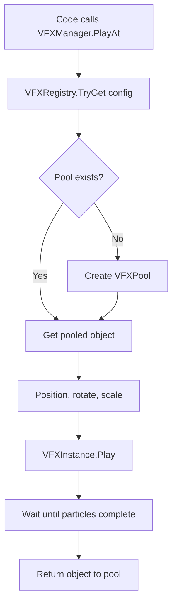

# VFX System

## Proposito

El VFX System reproduce efectos visuales por tipo y variante usando pooling. Evita instanciar/destruir particulas cada vez que se dispara un efecto.

## Piezas principales

- `VFXManager`: API principal para reproducir VFX.
- `VFXRegistry`: registra `VFXConfig` desde Resources o referencias manuales.
- `VFXPool`: pool por tipo/variante.
- `VFXInstance`: controla particulas y devuelve el objeto al pool.
- `VFXConfig`: ScriptableObject que une tipo, variante, prefab y tamano inicial del pool.

## Pipeline de funcionamiento

## Setup

1. Crear prefab de VFX con `ParticleSystem`.
2. Agregar `VFXInstance` al prefab.
3. Crear `VFXConfig` con `Create > VFX > Config`.
4. Asignar tipo, variante, prefab, pool inicial y si es expandable.
5. Guardar configs en `Resources/VFX/Configs` o asignarlas a `VFXRegistry.manualConfigs`.
6. Asignar `VFXManager` al `Bootstrap`.

## Pruebas

- Llamar `VFXManager.PlayAt(type, position)`.
- El efecto debe aparecer en la posicion correcta.
- Al terminar, el objeto debe desactivarse y volver al pool.
- Si se usa una variante inexistente, debe caer a `Default`.

## Troubleshooting

- Si no reproduce, revisar que exista `VFXManager.Instance`.
- Si hay warning de config, revisar `VFXConfig` duplicados o prefab null.
- Si no vuelve al pool, revisar que el prefab tenga `VFXInstance` y particulas.
